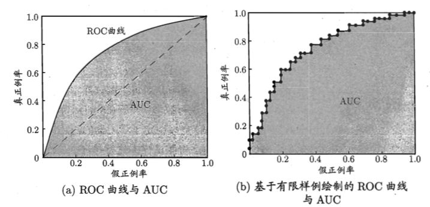

# Evaluation Methods in Face Recognition

## 1、Prerequisite

###  1.1、Precision、Recall

- 在分类问题中，虽然有常用的准确率、错误率这样的评价指标，但这并不能满足所有的任务需求。如在信息检索中，我们经常会关心`检索出来的信息有多少是用户感兴趣的`，`用户感兴趣的信息有多少被检索出来了`，`查准率（precision）`与`查全率（recall）`更适合此类需求的性能度量。

- 查准率又称为**准确率**，查全率又称为**召回率**。

- 对于二分类问题，可将样本根据模型预测的类别组合划分为真正例（True Positive）、假正例（False Positive）、真反例（True Negative）、假反例（False Negative）四种情形。令TP、FP、TN、FN分别为其对应的样例数，则显然又TP+FP+TN+FN=样例总数。分类结果的混淆矩阵（confusion matrix）如下所示：

  ​										表1 分类结果混淆矩阵

  <table>
     <tr>
        <td>真实情况</td>
        <td>预测结果</td>
        <td></td>
     </tr>
     <tr>
        <td></td>
        <td>正例</td>
        <td>反例</td>
     </tr>
     <tr>
        <td>正例</td>
        <td>TP（真正例）</td>
        <td>FN（假反例）</td>
     </tr>
     <tr>
        <td>反例</td>
        <td>FP（假正例）</td>
        <td>TN（真反例）</td>
     </tr>
  </table>

  (表格由Excel转html有问题)

- 查准率P与查全率R分别定义为：
  $$
  P = \frac{TP}{TP+FP}
  $$

  $$
  R = \frac{TP}{TP+FN}
  $$

### 1.2、ROC与AUC

- 很多模型是为测试样本预测出一个实值或者一个概率值，然后将这个预测值与一个分类阈值（threshold）进行比较，若大于阈值则分为正类，否则为负类。实际上，根据这个实值或概率预测的结果，我们可将测试样本进行排序，“最可能”是正例的放在最前面，“最不可能”是正例的排在最后面。这样分类过程就相当于在这个排序中以某个截断点（cut point）将样本分为两部分，前一部分判断为正例，后一部分判断为负例。

- 在不同的应用任务中，可根据任务需求来选择不同的截断点，若我们更注重“查准率”，可选择在排序中考前的位置进行截断；若更注重查全率，则可以在排序靠后的位置截断（宁可错杀一千也不放过一个）。因此排序本身质量的好坏体现了模型泛化性能的好坏。ROC曲线则是从这个角度出发来研究模型泛化性能的有力工具。

- **ROC**全称是“受试者工作特征”（Receiver Operating Characterristic）曲线，它来源于二战是用于敌机检测的雷达信号分析技术，后来被引入到机器学习领域。我们根据模型的预测结果对样例进行排序，按此顺序逐个把样本作为正例进行预测，每次计算出两个重要的值，分别以他们为纵、横坐标做图，就得到了**ROC曲线**。ROC曲线的纵轴是**真正例率**（True Positive Rate，**TPR**），横轴是**假正例率**（False Positive Rate，**FPR**），根据表1的符号，两者分别定义为：
  $$
  TPR = \frac{TP}{TP+FN}
  $$

$$
FPR = \frac{FP}{FP+TN}
$$

- 下图给了一个示意图，图中曲线对应一个随机猜测模型，（0， 1）点对应于所有正例都排在反例前面的理想模型。

  

图片来自《机器学习》-周志华

- 在现实任务中，我们只是对有限个测试样本进行绘制ROC图，此时只能获得有限个（假正例率，真正例率）坐标对，就无法获得如（a）的光滑的ROC曲线，就会获得如图（b）的近似的ROC曲线。绘图过程如下：给定

  m1个正例和m2个反例，根据模型预测结果对样例进行排序，然后把分类阈值设置为最大，即把所有样例都预测为反例，此时真正例率和假正例率都为0，在坐标（0， 0）处标记一个点，然后将分类阈值依次设置为每个样例的预测值，即依次将每个样例设置为正例，若前一个标记点坐标为（x, y），当前若为真正例，则对应标记点坐标为（x, y+1/m1）；若当前为假正例，则对应标记点坐标为（x+1/m2,  y），然后用线段连接相邻的点。

- 在进行模型比较时，若一个模型的ROC曲线被另外一个模型的ROC曲线完全包住时，则可断言后者性能优于前者。若两个模型的ROC曲线有交叉时，则很难断定孰优孰劣，比较合理的判据时根据ROC曲线下的面积，即**AUC**（Area Under ROC Curve），如上图所示。
  $$
  AUC = \frac{1}{2}\sum_{1}^{m-1}{(x_{i+1}-x_{i})(y_{i}+y_{i+1})}
  $$

- AUC考虑的是样本预测的排序质量。

## 2、Performance Measures

- 在人脸识别任务中，模型的表现通常在三个任务上进行衡量：1:1验证（`verification`）、开集识别（`open-set identification`）和闭集识别（`close-set identification`）
- 计算性能需要三组（sets）图像：`gallery `$G$（也称为底库，它是所有已知身份照片集合）和`probe`（也称为探针，它是待识别的人脸图像），`probe`又分为$P_n$和$P_g$，$P_n$为这个人不在`gallery`只能够的集合，也叫`imposter`，$P_g$指的是这个人在`gallery`中，也叫`genius`

- 在`Close-set Identification`中，要解决的问题是**Whose face is this？**，在`Open-Set Identification`中，要解决的问题**Do we konw this face?**如果认识，这个人是谁，在`Verification`中，要解决的任务是 i**s this person who he claims to be?** 
- `Close-set Identification`和`Open-Set Identification`有时也称为1:N匹配，`Verification`称为1:1匹配
- 比如IphoneX的面部解锁就是属于1:1 `verification`，警察在火车站进行身份证查验就是属于1:N `Open-Set Identification`，公司使用的人脸打卡属于1:N `Close-set Identification`

## 3、Open-Set Identification

- 在`Open-Set Identification`任务中，模型需要判断一个`probe`$P_j$在不在`gallery `$G$中，如果在，这个人是谁

- 假设$gallery G = \{g_1,...,g_|G|\}$，每个sample表示一个人，一个待测人脸probe $Pj$与每个sample$gi$计算出一个相似度（也可以时距离分数）$Sij$，表示两张图像为同一个人的可能性有多大。假设$Pj$所表示的人在`gallery G`中，假设$g^*$为实际正确的匹配结果，且$P_j$与$g^*$之间的相似度为$S_*j$，定义$id()$ 返回人脸图像的身份信息（即这个人是谁），所以有$id(P_j)=id(g^*)$

- `probe`$P_j$与`gallery`中的每个图像$g_i$进行匹配，将相似度值按照从大到小进行排序，定义$rank(P_j)=n$表示$P_j$与$g^*$的相似度派在第$n$位，$Rank 1$也称为top match

- 对于`Open-Set Identification`，有两个评估指标：**Detection and Identification Rate（DIR）**和**False Alarm Rate（FAR）**

- DIR

  - 首先看一个`probe`在`gallery`中的情况，即$P_j\in G$，如果$P_j$与真实的结果之间的相似度大于阈值$\tau$,且在所有的相似度中最大时实现了正确的识别，即：

    - $rank(P_j)=1$且
    - $S_*j\geq\tau$for the similarity match where $id(P_j)=id(g^*)$
    - DIR计算公式为：

    

- FAR

  - 第二个指标时FAR，衡量的时对于库外人员$P_j\in P_n$的识别性能，库外人员也称为imposter

    - 当imposter与G中的图像匹配结果top match score大于阈值时，就发生了false alarm，即$max_i {S_ij}\geq\tau$

    - FAR的计算公式：

      

- 在`Open-Set Identification`中，我们更关心的是在某些FAR时的DIR，我们希望的是FAR越低，DIR越高

## 4、Verification

#### 3.1、FAR

- 认假率FAR（False Accept Rate）表示错误的接受比例。在人脸1:1人脸比对的任务中，两张测试图像不是同一个人，但是被模型预测为同一个人。计算公式如下：
  $$
  FAR = \frac{非同人分数>T}{非同人比较的次数}
  $$

  - 在人脸验证的任务中，我门通常判断的给定的两张图片是否是同一个人。通常的做法是先将两张图片映射为两个高维向量，然后计算这两个向量之间的距离或相似度。FAR使用的是相似度（开始我认为是距离，怎么想这个公式的大于号写反了）。在计算时会给定一个相似度阈值T，如果两张图片的相似度大于这个阈值T，就判断为同一个人，如果小于这个值判断为不是同一个人。希望这个FAR越小越好。

#### 3.2、TAR

- TAR（True Accept Rate）表示正确的接受比例。即进行比对的同一个人的两张照片被预测为同一个人。计算公式如下：
  $$
  TAR = \frac{同人分数>T}{{同人比较的次数}}
  $$

  - 我们希望这个值越大越好

#### 3.3、FRR

- 错误拒绝率FRR（False Reject Rate）表示把相同的人判断为不同的人。计算公式如下：
  $$
  FRR = \frac{同人分数<T}{同人比较的次数}
  $$

##### Examples

- 考虑这样一种情况，假设我们有一个10个人（user_1--user_10）的数据库，每个人有10张照片，我们就有100张照片。现在我们选择user_1的一张照片当作template，其余9张照片都与这个照片进行验证，这样我们就得到了9个genuine scores，将其他9个user的90张照片当作impostors与之比对，这样我们就有了90个impostors scores，我们对所有用户的所有照片进行上述同样的工作，我们就有了900个genuine scores和9000个impostors scores。

- 假设我们选择的阈值为0.7，有100个impostors scores超过这个阈值，50个genuine scores小于这个阈值，则：
  $$
  FAR = \frac{impostors\ scores\ exceeding\ threshold}{all\ impostors\ scores} = \frac{100}{9000} = 0.011
  $$

  $$
  FRR = \frac{genuine\ scores\ below\ threshold}{all\ genuine\ scores} = \frac{50}{900}=0.056
  $$

所以FAR=1.1%，FRR=5.6%

## 5、Closed-Set Identification

- 在闭集测试中，我们通常关心前$n$个识别结果中是否包含了正确的结果

- 第一步是计算$P_j$与$g_i$的相似度分数，并按照从大到小进行排序，识别的准确率为正确的匹配结果包含在前$n$个匹配结果中的样本数与总样本数的比值，即

  

  - The identification rate at rank n is:

- `Closed-Set Identification`通常以累积匹配曲线（cumulative match characteristic，CMC）进行展示，横轴为rank值，纵轴为$P_I{(n)}$

  

- 我们通常关注的是rank1、rank5和rank10
- 这里的rank相当于Imagenet里的Top1 error和Top5 error